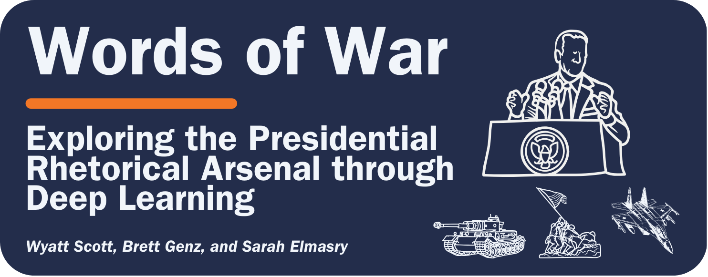
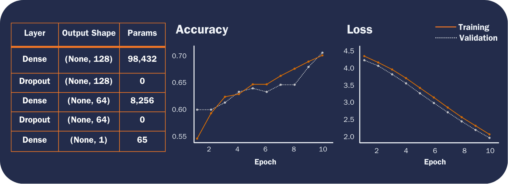
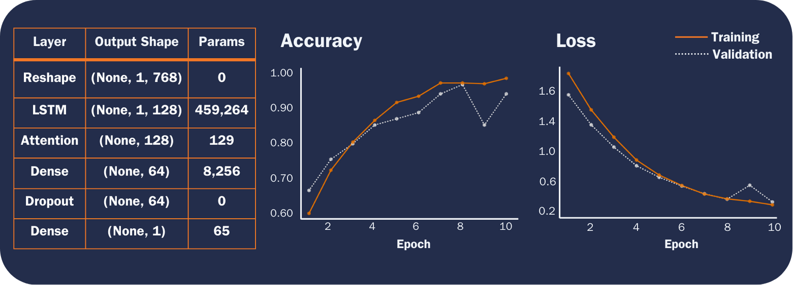

    

---

![Static Badge](https://img.shields.io/badge/Repo_Status%3A-Work_in_Progress-blue?style=flat&logo=data%3Aimage%2Fpng%3Bbase64%2CiVBORw0KGgoAAAANSUhEUgAAAC0AAAAiCAMAAAD8kqB9AAAClFBMVEUAAAD%2F%2F%2F%2FBYzTCysr2WxvyQRLnSibjUy3VZSLbQyvSjHHIjEX5%2F%2F%2F5%2B%2FvIz9D8%2F%2F%2F4WhryWRz3QBHxUR7ySh%2FxbBjsTiHwbxnnTCXVQiz96eTg4N%2Fd3dzL0tH0XDPFzc32SRv0UB%2F3WRr4XRn1SR32VBv1Uhz0TB71URz0QBDySh3%2FYAP4ZxT1YxnwXRz0ZxnvTh7vVR7yPhDxQhfrTB%2FcVCLfRSzUUCfdPCbLciPQOjLu8fHc5OXn5eT85uHj4uHY19bKt6%2F3WBv2Uhv0WS%2F1TSDyWjT0Sx33XBr3Vhv0Vxz3XRr3Xhr1Uhv0Ux30SRv0Whv3Yhn2Xhr0UhzzPg%2F2RBb0Tx7zPg%2FzPg7zUR33YxjyTh%2F7XgL6WQDxTh%2FwVB%2F3Pw%2FzPA3wTh7zYRv1aBntTCDxXhzrTx%2FwSh7oYCDxaxjuTiDmSyHsWR7rPxnoQiXnchrmehr%2B9%2FTs7%2FD%2B7unW2djQ19jm2dbHxcLKuLD3v6%2FJrKL1SRvvelv25ePBxML7aRfg7%2FbS5ezY7PDA1t32VBv2UBz0SR70QxT0QxT0QxT2VRv1VRz3Yhn1Sx34VRvyTB%2F1Sh71Rhj2Uhz2TBj3YRn3Yxn1RBb5ZBfxTB%2F2ZBn7Zgz4Zhj4QhPuWB30ZBrySR3yXhzvSyDvWRv3PxDvTR%2F0WRzyYhvyPQ32aRryahrvViDuYhnxQRPzbRrsRh%2FYXSPuchnrcxjRp5vqbEr5v6%2F0cU3wWDD849vQqqD3pI32n4b2moDfhmznlmTocVD0XjX5Vhrl5ubKtKvirZ%2FPpprTpZbWnI%2F8q3z2lnv4lHn5pXXwn27fhGrfgmjlkF%2F5klzmclPjcFD1bUn0Z0Ptd0H3bDb0VCr0WyT4WRn7YRf4PQvBMCeZAAAAs3RSTlMA%2FQj72VQnHBIPBgX%2B%2Fv78%2BKqajGI0LyolBv7%2B%2Fv79%2FPX09PTu287Cv7%2B1oqCTi394c1pONCIYFRINCv7%2B%2Fv7%2B%2Fv79%2Ffv39fHw7evp4uHS0M%2FMysXFwbq4s7Cwq6SimpGQgX59eHJoYFlRUElHRD8sGRX%2B%2Fv7%2B%2Fv7%2B%2Fv7%2B%2Fv38%2FPv6%2Bvn57u3p4%2BLd19bV0tLNzcrIwsC5trSnp6eioJ%2Bem5uVlZWRkIiDbmlcS0tEOTQjHZlkpy4AAAI7SURBVDjLYqAPyBHU0Y6NjZlvCuZxLp%2BtrR2jI5iOS7nWjX2nT1xQ5ARzuKdc3Xf%2BzDV%2Fdlyq2dt3NvHbqUhAzJ50vKWxzi0Pt1sSttRLM25bAWYbbXd0YDwVgcflEirH%2BHi2dpoBmVyhe%2BWtd7isBTLxGM4MNDyRQZKBdXtlKf%2FJCLzBwua%2BGWh4BzsDE8RoY%2FyhuGQLsz3%2F5USg0Y4yjHvCufCrZlPYLMuztYt9%2Bjk%2BXjs5Y0JRJAQ0nHFbiNthaaDRQD4RhlfdPsvHKyXHSjj%2BhfYz2xbVVtsw7tbkIqxaAmg4b3kFwmjChh%2BSgRhNGIi57iyTKS45YIRDHiAONMMvyjvw70Iz2hzOMs3kQDX8qI3UARRXc2duQJLXW4MsN%2FdS864QJiQBUb1cZHnTeQvFETwTxSNXkFxdoCdoguZ2wwDdjXDOguvqcKMLkwOEOTG8mh%2FpoysOM7xGBMrapM8SnIM1aDL8PGat4waxJFPZIe7V9fZNlcQRklYiagKB%2BqLcEJ74yqlKqklmeGLGyjjSU3laimiB%2BCrAoryVwkTMgYGHUzHIUjMDr1sNPso3BeLZcKpjMmfisEwTzErRiQpUVurXmNgm0Dtjjn7WsuRCDqAMWvj1%2BAWxsHgcdPJUnRwnst6CwVIsQ1ij28vpoAALS5Ca6mIU1aujVaINklp9s%2FMtkEQ52fKCneMN4tzDDNGcsmiCsIZzGoYLcxXVhNW1mNCFLZb6q2MrILO1%2BmZKYPMorlBlIBcAACpxj1lvNSqgAAAAAElFTkSuQmCC&labelColor=%23232D4B&color=%23E57200) &nbsp; &nbsp; &nbsp; &nbsp; &nbsp; &nbsp; &nbsp; &nbsp; &nbsp;

# Abstract

In political discourse and geopolitical analysis, national leaders' words hold profound significance, often serving as harbingers of pivotal historical moments. From impassioned rallying cries to calls for caution, presidential speeches preceding major conflicts encapsulate the multifaceted dynamics of decision-making at the apex of governance. This project aims to use deep learning techniques to decode the subtle nuances and underlying patterns of US presidential rhetoric that may signal US involvement in major wars. While accurate classification is desirable, we seek to take a step further and identify discriminative features between the two classes (i.e., interpretable learning).

Through an interdisciplinary fusion of machine learning and historical inquiry, we aspire to unearth insights into the predictive capacity of neural networks in discerning the preparatory rhetoric of US presidents preceding war. Indeed, as the venerable Prussian General and military theorist Carl von Clausewitz admonishes, "War is not merely an act of policy but a true political instrument, a continuation of political intercourse carried on with other means."1

<h1 style="font-size: 22px;">Report</h1>

## Table of Contents

<!--ts-->
   * [Introduction](#introduction)
   * [Methods](#methods)
   * [Literature Review](#literature-review)
      * [Datset](#dataset)
      * [Modeling Experiments](#modeling-experiments)
        * [MLP](#mlp)
        * [RNN with LSTM](#rnn-with-lstm)
        * [LSTM with Attention](#lstm-with-attention)
      * [Test Performance](#test-performance)
   * [Next Steps](#next-steps)
   * [Sources](#sources)
<!--te-->

# Introduction/Motivation

We aim to shed light on the interplay between the verbiage of national leaders and the inexorable currents of history that they set in motion. In addition to probing the efficacy of deep learning and natural language processing (NLP) while navigating the challenges inherent in the analysis of protracted textual corpora, we endeavor to examine how presidential rhetoric shapes, reflects and occasionally catalyzes the nation's trajectory toward pivotal global events. We aim to gauge the impact of leaders' orations on national decisions and international relations, furnishing novel insights and fresh perspectives on matters of global import.

Moreover, this interdisciplinary approach provides valuable tools for policymakers, historians, and the wider public. Deciphering the recurrent motifs within presidential addresses holds the potential to inform prognostication or influence forthcoming events, thereby exemplifying the enduring relevance of Clausewitzian principles in conjunction with contemporary technological innovations. In doing so, it bridges age-old theories with cutting-edge methodologies, fostering a more comprehensive understanding of how leaders adeptly frame their rhetoric to galvanize support for political endeavors. While impressive accuracy warrants attention and is important for a classification task as important as ours, we seek to make our model results interpretable; deep neural networks for classification are, to most, black boxes; we plan to use interpretable learning techniques to shed insight on how/why our models predict as they do.

# Literature Review

NLP has significantly improved in recent years, with techniques available today for handling progressively larger text documents. For longer texts, several studies show that Recurrent Neural Networks (RNN), particularly gated variants like Long Short-Term Memory (LSTM)2 and Gated Recurrent Unit (GRU)3, can capture patterns while retaining important contextual information.4,5 However, LSTM and GRU structures are inefficient because they conduct recurrent operations at the token level, and research suggests these structures can suffer from vanishing gradients during backpropagation when used for longer sequences.6

Nevertheless, gated architectures are instrumental in capturing sequential dependencies in text data, yet their effectiveness in handling long-term dependencies relevant to long-text modeling tasks poses a challenge that researchers have addressed using attention mechanisms.7 While attention mechanisms play a crucial role in enhancing predictive accuracy and model interpretability, addressing the challenge of handling long-term dependencies in text modeling tasks has led researchers to explore transformer-based architectures as a solution.8

Google's Bidirectional Encoder Representations from Transformers (BERT)9 is one example of such a model, but myriad transformer-based architectures have emerged since Google released BERT. Despite impressive performance on a wide range of NLP tasks, these models still impose a length limitation on each input sequence, which most longer text documents far exceed. BERT's self-attention mechanism, for example, can process a maximum of 512 tokens. This requires careful preprocessing to circumvent maximum sequence length limitations; for example, researchers have explored employing truncation, chunking, etc.10 Other newer approaches, like BigBird and Longformer, use sparse attention mechanisms with larger maximum token limits, and others explore fine-tuning BERT to work with longer text data, including ChunkBERT and BERT For Longer Texts (BELT).11,12

Research has shown that the structure of the BERT-based gated approaches, which use a fully connected encoding unit and apply the gate mechanism to update state memory, are computationally inefficient given the quadratic time complexity of applying self-attention in long-text modeling. A recent paper proposes addressing these issues using what the authors refer to as a Recurrent Attention Network (RAN).13 The RAN model uses positional multi-head self-attention on local windows for dependency extraction and employs a Global Perception Cell (GPC) vector to propagate information across windows, concatenated with tokens in subsequent windows. The GPC vector acts as a window-level contextual representation and maintains long-distance memory, enhancing local and global understanding. Additionally, a memory review mechanism allows the GPC vector from the last window to serve as a document-level representation for classification tasks.

When it comes to interpretable learning, however, recent research suggests this technique may not provide much in terms of interpretability.14 Researchers recently developed an approach called ProtoryNet, which makes predictions by finding the most similar prototype for each sentence in a sequence and feeding an RNN backbone with the proximity of each sentence of the corresponding active prototype. The RNN backbone then captures the temporal pattern of the prototypes, which the authors refer to as 'prototype trajectories.' These trajectories enable intuitive, find-grained interpretation of the RNN model's reasoning process.15

# Methods

## Dataset

The data for this project comes from Joseph Lilleberg's Kaggle dataset, "United States Presidential Speeches," which Lilleberg scraped from The Miller Center at the University of Virginia.16 We added a column to the Kaggle dataset that represents our binary categorical response variable (War), indicating whether the US entered a major war within one year of the president's speech. If the US entered a major war within one year of the president's speech, then the observation's value for the War variable is 1; if the US did not enter a major war within one year of the president's speech, that observation gets a 0 value for the War variable. We derived wars' start dates from the US Congressional Research Service.17 

This dataset provides a robust framework for a comprehensive exploration of presidential rhetoric. Including the 'Party' variable allows us to examine whether patterns exist in political affiliation and the content and tone of presidential speeches.

We perform some slight cleaning and preprocessing to set up the data for modeling. First, we checked for null values and found one missing transcript for a speech delivered by Thomas Jefferson on Nov. 8, 1808; we found the transcript via the Miller Center and added it to the dataset. Next, because the first war we consider (First Barbary War) started in 1801, we filter the dataset to speeches dated after 1800.

Several transcripts end with the president's signature; we remove the signature text from the transcripts column given that the president is identifiable from the president column and that text is not important for our modeling purposes. The transcripts also contain instances of long integers and floating point numbers when a president describes various treasury and debt statistics, for example. We remove floating point numbers and integers from the transcripts. Additionally, we convert the transcripts to lowercase and remove punctuation.

After cleaning the data and adding our response variable, the dataset contains 964 observations and exhibits significant class imbalance. There are 883 observations classified as War = 0 and 81 observations classified as War = 1; roughly 92% of the speeches were not delivered within one year of the US entering a major war. We use the Synthetic Minority Over-sampling Technique (SMOTE) to balance the classes, and, as the authors suggest, we combine SMOTE with random undersampling of the majority class.18 We combine these transformations into a single pipeline.

## Modeling Experiments

We built a custom Python class that leverages a pre-trained BERT model to tokenize and vectorize the raw text data, converting the speeches into fixed-length vectors that we pass as inputs to our models.

We experiment with several deep learning techniques to compare various neural network model architectures. In comparing these differing approaches to long document classification, we will use a binary cross entropy loss function and evaluate model performance across accuracy, F1-Score, and Area Under the Receiver Operating Characteristic Curve (AUC-ROC). We use a train, test, and validation split of 80%, 10%, and 10%, respectively. We experiment with three models: a multilayer perceptron (MLP), an RNN with an LSTM layer, and the same RNN with an LSTM layer, but this time, we include Attention mechanisms for interpretable learning at the token level. We train the models for ten epochs using batches of size 32.

While accurate classification is desirable, we seek to take a step further and identify discriminative features between the two classes. Our third model architecture includes an attention layer that calculates attention weights for each timestep, allowing the model to focus on relevant parts of the input sequence during prediction. We define a custom Python class to compute the attention weights using trainable parameters. We further describe the interpretable learning in the subsection below.

### MLP

For our first experiment, we built an MLP consisting of two dense hidden layers with ReLU activation followed by dropout regularization and an output layer with a sigmoid activation function. We apply L2 regularization of 0.01 to the kernel weights in all dense layers to prevent overfitting. When compiling the model, we use the Stochastic Gradient Descent optimizer with a learning rate of 0.001 and Nesterov momentum of 0.99.

This first model achieves 81.51% training accuracy and 79.83% validation accuracy by epoch ten, with the training and validation losses steadily decreasing to 2.16 and 2.07, respectively. On the test set, the AUC-ROC is 86.70, and the F1-Score is 76.19.

    

### RNN with LSTM

In our second approach, we reshape the input data to include a timestep dimension before it's fed into the LSTM layer, allowing the model to effectively capture temporal dependencies in the input data. With 128 units, the LSTM layer utilizes hyperbolic tangent activation, Glorot uniform, and orthogonal initializers, along with dropout of 0.1 and recurrent dropout of 0.1 for regularization. Next comes a densely connected layer consisting of 64 units with ReLU activation, He normal initialization, and L2 regularization of 0.1. We added a dropout layer to apply further regularization and mitigate overfitting. Given that we're performing binary classification, the final layer is a dense output layer with a sigmoid activation function. We apply L2 regularization to the kernel weights in both dense layers to further prevent overfitting. When compiling the model, we use the Adam optimizer with a learning rate of 0.001.

This model achieves 85.40% training accuracy and 83.19% validation accuracy by the fifth epoch, achieving 95.27% training accuracy and 92.44% validation accuracy by epoch ten. The training and validation loss are 0.2889 and 0.3112 by the tenth epoch. On the test set, the AUC-ROC is 95.56, and the F1-Score is 91.52.

    

### LSTM with Attention

This model architecture is the same as the previous model except that we include a custom attention layer between the LSTM layer and the first dense layer to dynamically weigh the input sequence elements based on their importance. As with the second model, we use the Adam optimizer with a learning rate of 0.001.

This model achieves 86.13% training accuracy and 87.39% validation accuracy by the fifth epoch, eventually achieving 95.80% training accuracy and 89.92% validation accuracy by epoch ten. The training and validation loss are 0.2842 and 0.3447 at the tenth epoch. On the test set, the AUC-ROC is 94.46, and the F1-Score is 88.52.

After defining, compiling, and training this model, we create another model called using the Model class, specifying the same inputs as the LSTM model with Attention but setting the output to that of the attention layer. This allows us to extract the attention weights, providing insights into how the attention mechanism weighs different parts of the input sequence. The Next Steps section describes how we plan to use the extracted attention weights for interpretable learning.

    

## Test Performance

    

# Next Steps

Moving forward, we plan to try one additional model: a pre-trained transformer model. We're still determining which transformer to use and will explore several options, allowing computational efficiency and recorded performance on binary classification tasks to guide our decision. We encountered challenges when aligning the dimensions of our preprocessed data with the requirements of the transformer models we've been exploring. To address this, we may need to refine our data preprocessing to ensure compatibility with the selected transformer model or potentially leverage a unique preprocessing pipeline. This approach includes meticulous fine-tuning of the model, informed by best practices, to achieve optimal results. 

In parallel, we will explore interpretative learning techniques/methodologies to determine if we can identify discriminative features between the two classes and gain insights into our models' decision-making processes. This will be adaptive and shaped by our ongoing challenges and insights to better understand patterns for classification. 

We plan to explore the extracted attention weights from our third model via visualization and analyzing summary statistics (e.g., the mean of the attention weights for each class). We can also perform some basic statistical tests to compare the attention weights between the two classes. Additional approaches we're considering include using the pre-trained ProtoryNet model, Local Interpretable Model-agnostic Explanations (LIME), and Shapley Additive exPlanations (SHAP).

<h2 style="font-size: 18px;">Sources</h2>

[1]: von Clausewitz, C. (1997). On War (J. J. Graham, Trans.). Wordsworth Editions.

[2]: Sepp Hochreiter and Jurgen Schmidhuber. (1997). Long Short-Term Memory. Neural Computation 9, no. 8, pp. 1735-1780. See also Hasim Sak et al. (2014). Long Short-Term Memory Based Recurrent Neural Network Architectures for Large Vocabulary Speech Recognition. ArXiv 1402.1128v1.

[3]: Kyunghyun Cho et al. (2014). Learning Phrase Representations Using RNN Encoder-Decoder for Statistical Machine Translation. Proceedings of the 2014 Conference on Empirical Methods in Natural Language Processing, pp. 1724-1734.

[4]: Zhou, Chunting, Chonglin Sun, Zhiyuan Liu and F. Lau. (2015). A C-LSTM Neural Network for Text Classification. ArXiv abs/1511.08630.

[5]: Hassan, Abdalraouf and Ausif Mahmood. (2018). Convolutional Recurrent Deep Learning Model for Sentence Classification. IEEE Access 6, pp. 13949-13957.

[6]: DeLesley Hutchins et al. (2022). Block-Recurrent Transformers. ArXiv 2203.07852v3.

[7]: Dzmitry Bahdanau et al. (2014). Neural Machine Translation by Jointly Learning to Align and Translate. ArXiv 1409.0473.

[8]: Ashish Vaswani et al. (2017). Attention is All You Need. Proceedings of the 31st International Conference on Neural Information Processing Systems, pp. 6000-6010.

[9]: Jacob Devlin et al. (2019). BERT: Pre-Training of Deep Bidirectional Transformers for Language Understanding. Proceedings of the 2018 Conference of the North American Chapter of the Association for Computational Linguistics: Human Language Tchnologies 1.

[10]: Zican Dong et al. (2022). A Survey on Long Text Modeling with Transformers. ArXiv 2302.14502v1. See also Park et al. (2022). Efficient Classification of Long Documents Using Transformers. ArXiv 2203.11258v1.

[11]: Aman Jaiswal and Evangelos Milios. (2023). Breaking the Token Barrier: Chunking and Convolution for Efficient Longer Text Classification with BERT. ArXiv 2310.2055av1.

[12]: Michal Brzozowski. (2023). Fine-tuning BERT model for arbitrarily long texts Part 1. MIM AI. https://www.mim.ai/fine-tuning-bert-model-for-arbitrarily-long-texts-part-1/. See also Michal Brzozowski. (2023). Fine-tuning BERT model for arbitrarily long texts, Part 2. MIM AI. https://www.mim.ai/fine-tuning-bert-model-for-arbitrarily-long-texts-part-2/. For technical documentation, see Michal Brzozowski and Marek Wachnicki. (2023). Welcome to BELT (BERT For Longer Texts)'s documentation. MIM AI. https://mim-solutions.github.io/bert_for_longer_texts/. 

[13]: Xianming Li et al. (2023). Recurrent Attention Networks for Long-text Modeling. Findings of the Association for Computational Linguistics (ACL), pp. 3006-3019.

[14]: Sarthak Jain and Byron C. Wallace. (2019). Attention is not Explanation. ArXiv 1902.10186v3.

[15]: Dat Hong et al. (2023). ProtoryNet - Interpretable Text Classification Via Prototype Trajectories. Journal of Machine Learning Research 24, pp. 1-39.

[16]: Lilleberg, J. (2020). United States presidential speeches. Kaggle. https://www.kaggle.com/datasets/littleotter/united-states-presidential-speeches; Data scraped from The Miller Center at the University of Virginia, https://millercenter.org/the-presidency/presidential-speeches.

[17]: Barbara Salazar Torreon and Carly A. Miller, US Congressional Research Service. (2024). U.S. Periods of War and Dates of Recent Conflicts, available at https://sgp.fas.org/crs/natsec/RS21405.pdf.

[18]: Nitesh V. Chawla et al. (2002). SMOTE: Synthetic Minority Over-sampling Technique. Journal of Artificial Intelligence 16, pp. 321-357.

<h1 style="font-size: 22px;">Manifest</h1>

  

Python Module Files (helper functions, classes)

  
### [`BertSeqVect.py`](https://github.com/WD-Scott/WordsofWar/blob/main/Python_Modules/BertSeqVect.py)

This Python module file includes the `BertSequenceVectorizer` class, which we designed to convert input text into vector representations using a pre-trained the Bidirectional Encoder Representations from Transformers (BERT) model.

  * Features:
    
    **BERT-based Vectorization**: Utilizes a pre-trained BERT model to generate vector representations of input text.
    
    **Tokenization**: Employs the BERT tokenizer to tokenize input text before vectorization.
    
    **Customizable Sequence Length**: Allows customization of the maximum length of input sequences for vectorization.
 
  * Usage
    
    Upon instantiation of the `BertSequenceVectorizer` object, the class automatically loads a pre-trained BERT model (bert-base-uncased by default) and its corresponding tokenizer, specifying the maximum length of input sequences for vectorization.

### [`plot_history.py`](https://github.com/WD-Scott/WordsofWar/blob/main/Python_Modules/plot_history.py)

This Python module file contains a helper function for plotting model history (accuracy, validation accuracy, loss, and validation loss).
    

 

Jupyter Notebooks

### [`Cleaning_Data.ipynb`](https://github.com/WD-Scott/WordsofWar/blob/main/Jupyter_Notebooks/Cleaning_Data.ipynb)

The Jupyter Notebook contains the code we used to clean the input data (speeches.csv) and set up the training, testing, and validation sets. In this notebook, we use the pre-trained BERT model and vectorizer (see BertSeqVect.py) to tokenize and vectorize the text data.

### [`EDA.ipynb`](https://github.com/WD-Scott/WordsofWar/blob/main/Jupyter_Notebooks/EDA.ipynb)

This Jupyter Notebook contains code and visualizations from our exploratory data analysis.

### [`Modeling.ipynb`](https://github.com/WD-Scott/WordsofWar/blob/main/Jupyter_Notebooks/Modeling.ipynb)

This Jupyter Notebook contains our code for the modeling experiments. We experiment with three models: (1) MLP, (2) gated RNN (LSTM), and (3) the same second model but with Attention mechanisms. After developing these models, we use the third approach to begin exploring various ways to perform interpretable learning to discern how the model differentiates the two classes. Eventually, we will incorporate a fourth approach; a pre-trained transformer.

 

Data Files

### [`Speeches_War_Clean.csv`](https://github.com/WD-Scott/WordsofWar/blob/main/Data_Files/Speeches_War_Clean.csv)

This file contains the cleaned data that we use for modeling.

### [`presidential_speeches.csv`](https://github.com/WD-Scott/WordsofWar/blob/main/Data_Files/presidential_speeches.csv)

This file contains the original source data.

### [`X_test.csv`](https://github.com/WD-Scott/WordsofWar/blob/main/Data_Files/X_test.csv)

This file contains the testing features (the vector representations of the input text).

### [`X_train.csv`](https://github.com/WD-Scott/WordsofWar/blob/main/Data_Files/X_train.csv)

This file contains the training features (the vector representations of the input text).

### [`X_val.csv`](https://github.com/WD-Scott/WordsofWar/blob/main/Data_Files/X_val.csv)

This file contains the validation features (the vector representations of the input text).

### [`y_test.csv`](https://github.com/WD-Scott/WordsofWar/blob/main/Data_Files/y_test.csv)

This file contains the testing labels (binary response variable 'War').

### [`y_train.csv`](https://github.com/WD-Scott/WordsofWar/blob/main/Data_Files/y_train.csv)

This file contains the training labels (binary response variable 'War').

### [`y_val.csv`](https://github.com/WD-Scott/WordsofWar/blob/main/Data_Files/y_val.csv)

This file contains the validation labels (binary response variable 'War').

